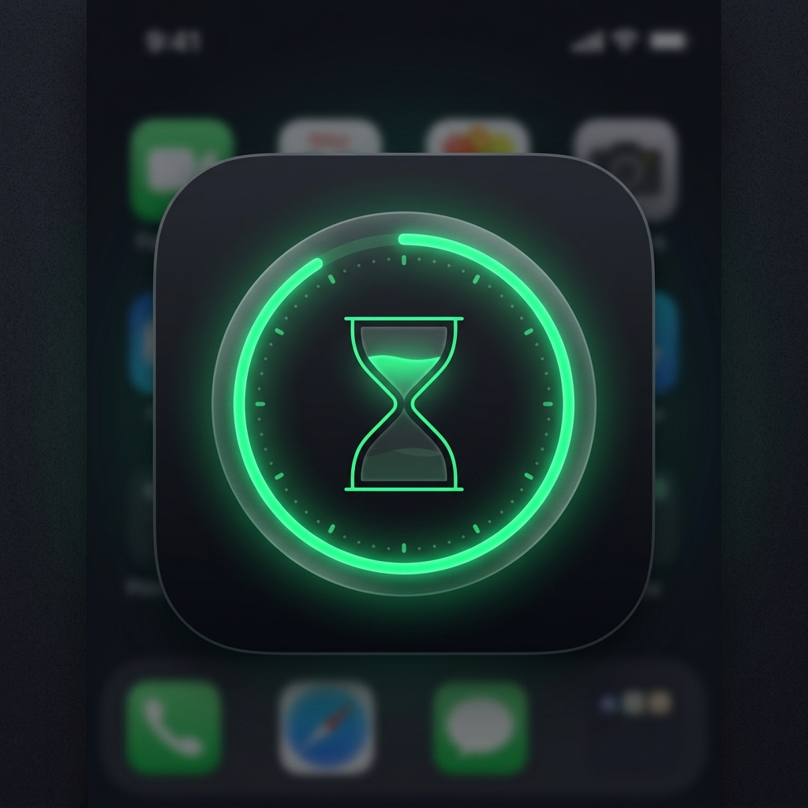

# Focus App (Desktop)

A minimal, high-performance desktop focus timer designed for deep work sessions. Built with Electron, React 19, TypeScript, and Tailwind CSS, Focus App provides a beautifully native, highly-featured, distraction-free environment to help you maintain flow.



## Features

- **Adaptive Focus Modes**:
  - **Focus**: 25-minute Pomodoro sessions.
  - **Deep**: 50-minute blocks for complex tasks.
  - **Ultra**: 90-minute extended sessions for maximum immersion.
- **Picture-in-Picture (PiP) Mode**: Automatically collapses into an ultra-compact widget while your timer is running, keeping your screen clutter-free.
- **Spotify Integration**: Connect and control your Spotify music playback directly inside the app.
- **Ambient Soundscapes**: Built-in high-quality audio environments including Cafe, Forest, Rain, and White Noise.
- **Native Experience**: Frameless window design, transparent background support, and cross-platform installation for macOS and Windows. 

## Tech Stack

- **Desktop Framework**: [Electron](https://www.electronjs.org/) & [Electron-Vite](https://electron-vite.org/)
- **Frontend Framework**: [React 19](https://react.dev/)
- **Build Tool**: [Vite 8](https://vitejs.dev/)
- **Styling**: [Tailwind CSS 4](https://tailwindcss.com/)
- **Animations**: [Framer Motion](https://www.framer.com/motion/)

## Getting Started

### Prerequisites

- [Node.js](https://nodejs.org/) (v18 or higher recommended)
- [npm](https://www.npmjs.com/)

### Installation

1. Clone the repository:
   ```bash
   git clone https://github.com/yourusername/focus-app.git
   cd focus-app
   ```

2. Install dependencies:
   ```bash
   npm install
   ```

3. Start the development server (runs the Electron app locally):
   ```bash
   npm run dev
   ```

## Packaging & Distribution

To compile the application into production-ready installers for your platform and operating system:

**To build for Windows (.exe)**
```bash
npm run build:win
```

**To build for macOS (.dmg / .zip)**
```bash
npm run build:mac
```

**To build for both platforms simultaneously:**
```bash
npm run dist
```

Your installation packages will be automatically generated inside the `dist/` directory.

## License

MIT &copy; 2026 Focus App
